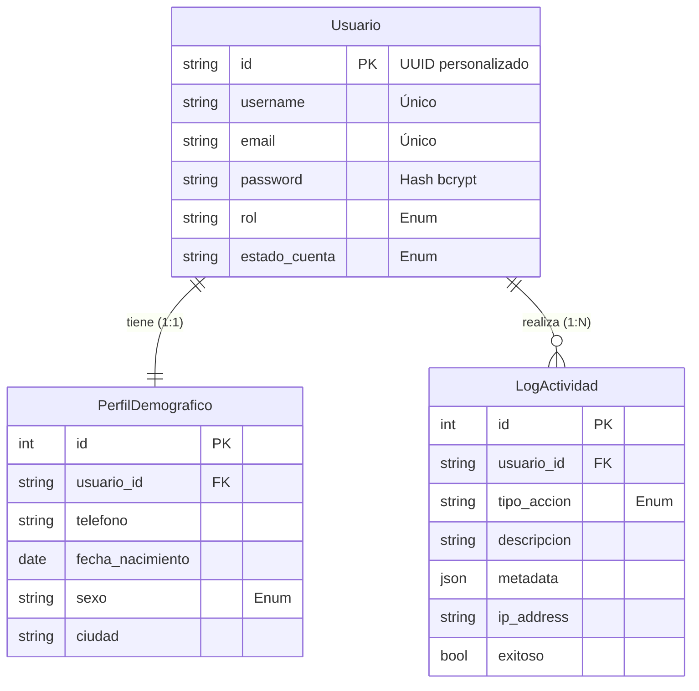

# Modelos de Datos - VOCES

Este documento describe la estructura de datos de la plataforma VOCES, incluyendo los modelos de usuario, perfiles y sistema de auditoría.

## 📚 Índice

1. [Diagrama General](#diagrama-general)
2. [Usuario y Perfil](#usuario-y-perfil)
3. [Sistema de Auditoría (LogActividad)](#sistema-de-auditoría-logactividad)
4. [Enums y Constantes](#enums-y-constantes)

---

## Diagrama General



---

## Usuario y Perfil

### Modelo `Usuario`
**Archivo:** `app/models/usuario.py`

Es el núcleo de la identidad en la plataforma. Maneja la autenticación y la información pública básica.

- **Identificador (`id`):** UUID personalizado de 6 caracteres (ej: `ABC123`) para URLs amigables.
- **Autenticación:** `email` y `password` (hasheada).
- **Roles:** Definidos en `RolUsuario` (Usuario, Editor, Moderador, Admin).
- **Estado:** Controlado por `EstadoCuenta` (Activo, Suspendido, Baneado, etc.).
- **Mixins:** Hereda de `TimestampMixin` (fechas), `RedesSocialesMixin` y `EstadisticasMixin`.

### Modelo `PerfilDemografico`
**Archivo:** `app/models/perfil_demografico.py`

Extensión 1:1 del usuario que almacena datos personales y demográficos.
> **Nota:** Estos datos son opcionales y están separados para permitir que el usuario decida qué compartir, especialmente útil para el módulo de encuestas.

- **Datos Personales:** `fecha_nacimiento`, `sexo`, `telefono`.
- **Ubicación:** `ciudad`, `departamento`, `pais`.
- **Socioeconómico:** `nivel_educativo`, `ocupacion`.
- **Sincronización:** Los cambios en este modelo actualizan automáticamente el `actualizado_en` del Usuario mediante eventos.

---

## Sistema de Auditoría (LogActividad)

**Archivo:** `app/models/log_actividad.py`

El modelo `LogActividad` es el "caja negra" del sistema. Registra **CADA** acción importante que ocurre en la plataforma, funcionando como un log de consola persistente y estructurado.

### 🎯 Propósito
1. **Seguridad:** Detectar accesos no autorizados o intentos de fuerza bruta.
2. **Debugging:** Entender qué hizo un usuario antes de un error.
3. **Métricas:** Analizar el uso de funcionalidades (ej: cuántos usuarios editaron su perfil hoy).
4. **Moderación:** Historial de acciones de moderadores y usuarios reportados.

### 📋 Estructura del Modelo

| Campo | Tipo | Descripción |
|-------|------|-------------|
| `usuario_id` | `str` (FK) | Quién realizó la acción. `NULL` si es un usuario anónimo (ej: intento de login). |
| `tipo_accion` | `TipoAccion` | Categoría de la acción (ver Enums). |
| `descripcion` | `str` | Texto legible por humanos explicando qué pasó. |
| `metadata` | `JSON` | **CRÍTICO:** Datos técnicos detallados del evento. |
| `ip_address` | `str` | Dirección IP del cliente. |
| `user_agent` | `str` | Navegador y sistema operativo del cliente. |
| `exitoso` | `bool` | `True` si la acción se completó, `False` si falló. |
| `mensaje_error`| `str` | Detalle del error si `exitoso` es `False`. |

### 💡 Ejemplos de Uso

#### 1. Registro de Login Exitoso
```json
{
  "tipo_accion": "Login",
  "descripcion": "Inicio de sesión exitoso",
  "usuario_id": "ABC123",
  "ip_address": "192.168.1.50",
  "metadata": {
    "metodo": "email",
    "dispositivo": "Movil"
  }
}
```

#### 2. Intento de Login Fallido (Seguridad)
```json
{
  "tipo_accion": "IntentoLoginFallido",
  "descripcion": "Credenciales inválidas",
  "usuario_id": null,
  "ip_address": "203.0.113.1",
  "exitoso": false,
  "metadata": {
    "email_intentado": "admin@voces.com",
    "motivo": "password_incorrecto"
  }
}
```

#### 3. Cambio de Perfil (Auditoría de Cambios)
```json
{
  "tipo_accion": "ActualizacionPerfil",
  "descripcion": "Usuario actualizó su biografía",
  "usuario_id": "XYZ789",
  "metadata": {
    "campos_modificados": ["biografia", "twitter_handle"],
    "valores_anteriores": {
      "twitter_handle": null
    },
    "valores_nuevos": {
      "twitter_handle": "@usuario_voces"
    }
  }
}
```

#### 4. Acción de Moderación
```json
{
  "tipo_accion": "AccionModeracion",
  "descripcion": "Moderador ocultó comentario ofensivo",
  "usuario_id": "MOD001",
  "metadata": {
    "target_id": "COMENTARIO_123",
    "target_type": "comentario",
    "accion": "ocultar",
    "razon": "lenguaje_inapropiado"
  }
}
```

---

## Enums y Constantes

**Archivo:** `app/models/enums.py`

### `TipoAccion`
Categoriza todas las posibles interacciones en el sistema:

- **Autenticación:** `Login`, `Logout`, `RegistroExitoso`, `IntentoLoginFallido`
- **Perfil:** `ActualizacionPerfil`, `CambioPassword`, `VerificacionEmail`
- **Contenido:** `CreacionPublicacion`, `EdicionPublicacion`, `EliminacionPublicacion` (y variantes para Reviews/Comentarios)
- **Interacciones:** `Like`, `Unlike`, `Compartir`, `Seguir`
- **Sistema:** `ErrorSistema`, `AccesoNoAutorizado`

### `EstadoCuenta`
Ciclo de vida del usuario:
`PendienteVerificacion` → `Activo` → (`Suspendido` / `Baneado` / `Inactivo` / `Eliminado`)
